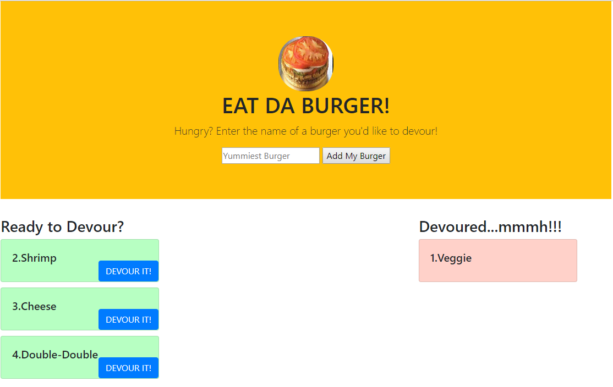

# Eat Da Burger!
A Burger Eatin' Application With Node.js/Express/MySQL/Handlebars/Bootstrap4

## Description
This application demonstrates a simple full stack application with a front end implemented with HTML/CSS and elements from the Bootsrap4 framework and the backend implemented with Node.js and Express. HTML templating is done with the help of Handlebars.

The user may enter any burger name to add it to the menu. This also adds the new burger entry into the MySQL database. The initial burger entry is added as available on the menu and placed on the left side of the screen. The user may then eat any burger by clicking on the DEVOUR button, which moves it into the adjacent column and updates its status to devoured in the database.

## Demo
The demo of the burger eating application can be found [here](https://pacific-bayou-28835.herokuapp.com/).

## Installation
To run the application locally, first clone this repository with the following command.

git clone https://github.com/pmutunga/burger
Next, install the application dependencies.

cd eat-da-burger
npm install
Finally, run the node server locally.

### node server
Now, open the local application on port 3000 at the URL: http://localhost:3000/.

Enjoy and have a burger!

